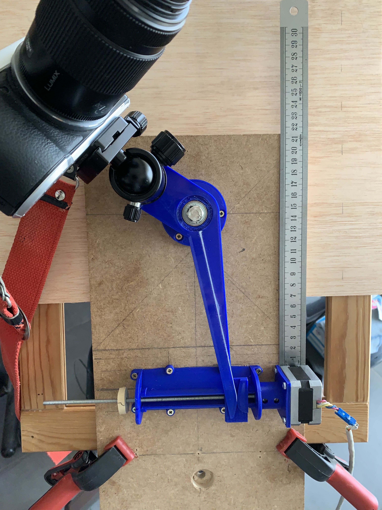

# Old trick, new tools and technologies
Back in 1953, a French astronomer, André Hamon, described a mechanism to correct errors of tangent drives in an article of the «Société Astronomique de France» Bulletin.
The article, written in the perspective of building the device, precisely described how the profile of cams could be drafted on a transparent plexiglas sheet using a ruler and compasses. A full scan in PDF format can be found [here.](http://www.astrosurf.com/astroptics/files/hamon_1953.pdf)
An English translation to this article was published in [«Sky & Telescope» June 1978.](https://archive.org/details/Sky_and_Telescope_1978-06-pdf/page/n73)

Today, the digital incarnation of the drawing board is a CAD software, and with a bit of adaptation, the same constructs can be done on screen. Then the most advanced tools also include a CAM integration to drive digital manufacturing of the designs.
This is the purpose of this project, its goal is to bring back an old trick to the attention of amateur astronomers or photographers who want to practice astrophotography with very long shutter time, ideally using the «Bulb» shutter mode of a digital camera.

# Observing the sky
Imagine the picture of the stars in the sky were printed inside an umbrella. We open the umbrella and point it in direction of Polaris, the northern star, and slowly rotate the handle in the counter clockwise direction to keep up with the sky rotation in 1440 minutes every day, letting some stars disappear behind the horizon on the left (west) and other ones appear on the right (east). It is the movement that astronomers and photographers want to keep up with.

# Other well known solutions
There is another family of such devices called «Barn Door Tracker» or «Haig arm»

# Specific features of this solution
This solution is relying on cams to correct errors, or fill the gap, between constant angular speed and constant linear speed along a tangent to an apparently circular path followed by stars and planet.

The driving screw used does not support the full weight of the camera, and of the arm itself. It can be small. An M4 screw is used here, with a 0.7mm pitch. Hamon's 30-minute run is now 21mm instead of the 30mm described in the article.

The camera is safely attached to the device with an M8 screw.

A type 608 ballbearing is used to allow minimal rotation resistance.

# Project documents
The project was designed using Autodesk Fusion 360 used with a hobbyist license.

It can be accessed [here](https://a360.co/2JHPxIf)

STL ASCII files are stored in this repository

# Design images
3D printed device

Profiles of cams

Assembly

# Sample images
Moonshot with stars in background @f=350mm, s=60s, f/d=22, iso=125 

Same picture without driving

# Related project
[How to drive a stepper motor](https://github.com/jaypeeds/StarTracker)
